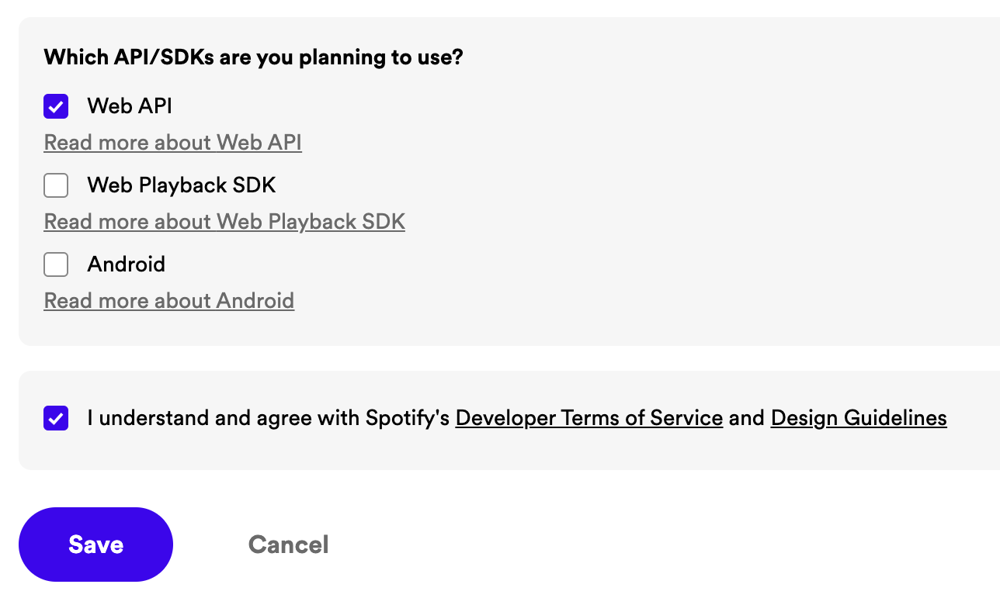

# spotify-obs


## 개요

spotify-obs는 Spotify에서 재생 중인 음악 정보를 웹 상에 실시간으로 표시해주는 프로젝트입니다. Youtube, Twitch 등 온라인 스트리밍을 할 때 OBS, Xsplit과 같은 녹화 프로그램의 **'브라우저 소스'를 활용하여 재생 중인 음악 정보를 스트리밍 화면에 표시할 수 있습니다.** 자신의 컴퓨터 또는 서버에서 직접 웹서버를 구동하는 selfhost 방식입니다.

## 설치

### API 키 발급

[Spotify for developers 페이지에 로그인합니다.](https://developer.spotify.com/)


- App name: 원하는 프로젝트 이름
- App Description: 원하는 프로젝트 설명
- Website: 입력 안함
- Redirect URI: 자신의 PC에서 구동시킬 경우 `http://localhost:<포트>/callback`, 서버에서 구동시킬 경우 `http://<서버 도메인 또는 IP>:<포트>/callback`을 입력합니다. `<포트>`는 구동을 원하는 포트를 입력합니다.



Web API에 체크, 약관 동의 체크 한 후 Save를 누릅니다.


오른쪽 위 Settings 버튼을 누르고 View client secret을 눌러 `Client ID`와 `Client secret`을 확인합니다. 잠시 후 `docker-compose.yml` 파일에 사용될 값입니다.

### Docker 설치

만약 Docker가 설치되어 있지 않다면 [공식 문서를 참고하세요.](https://docs.docker.com/desktop/) Docker Desktop을 설치해도 되고, CLI로 설치해도 됩니다. CLI로 설치했다면 [docker-compose도 추가로 설치해주세요.](https://docs.docker.com/compose/install/)

### docker-compose.yml 설정

```sh
wget https://raw.githubusercontent.com/D3vle0/spotify-obs/main/docker-compose.yml
```

다운로드 받은 docker-compose.yml을 아래와 같이 편집합니다.

```yaml
version: "3"
services:
  spotify-obs:
    ports:
      - <PORT>:8888
    container_name: spotify-obs
    restart: unless-stopped
    environment:
      - CLIENT_ID=<CLIENT_ID>
      - CLIENT_SECRET=<CLIENT_SECRET>
      - HOST=<HOST>
      - PORT=<PORT>
    image:
      d3vle0/spotify-obs
```

`<PORT>`는 원하는 포트, **API 키를 등록할 때 작성했던 callback URI의 포트와 동일해야 합니다.**  
`CLIENT_ID`와 `CLIENT_SECRET`에 API 발급 후 확인했던 값을 입력합니다.  
`<HOST>`는 호스트 주소, **callback URI의 host와 동일해야 합니다.**

### 실행

```sh
docker-compose up -d
```